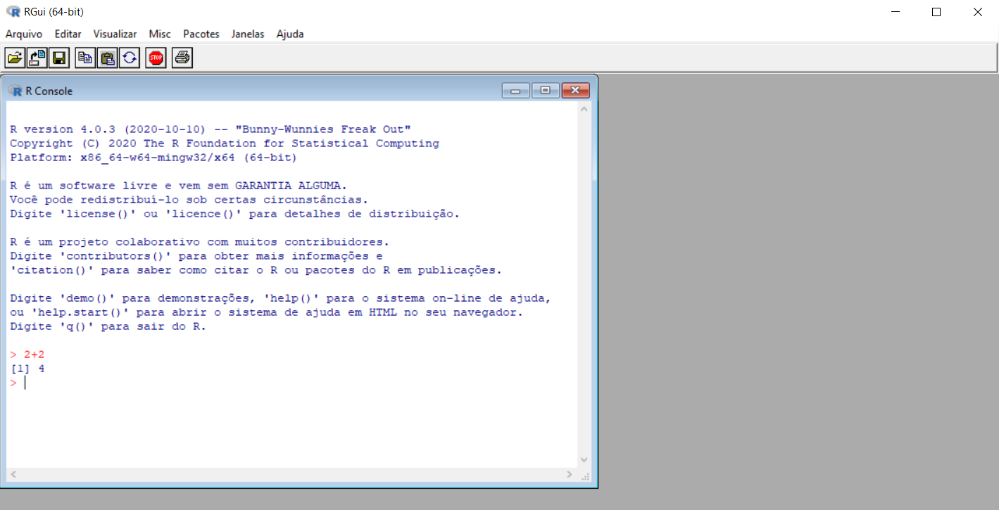
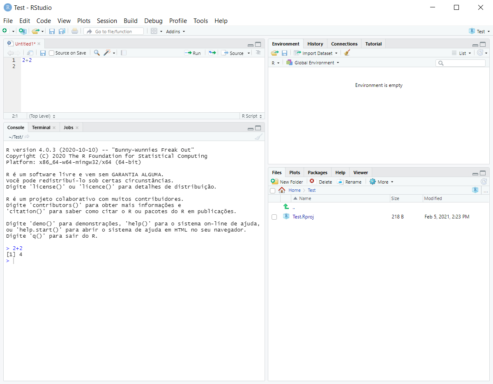

```{r setup, include=FALSE}
knitr::opts_chunk$set(echo = TRUE)
```

### Um pouco da história do `R`...


<p style="text-align: center;"></p>

<p style="text-align: justify;">  `R` é uma linguagem e também um ambiente de desenvolvimento integrado para cálculos estatísticos e gráficos. Originalmente foi criada por Ross Ihaka e por Robert Gentleman, em 1993, no departamento de Estatística da universidade de Auckland, Nova Zelândia. Foi desenvolvido em um esforço colaborativo de pessoas em vários locais do mundo e teve como inspiração a linguagem S, criada na AT&T Bell Labs por John Chambers, Rick Becker e Allan Wilks em 1976. Assim, o nome `R` surgiu de uma brincadeira com o nome da linguagem S e, claro, das iniciais dos nomes dos criadores (Ross e Robert).</p>


### Por que usar `R`?

<p style="text-align: justify;">  A linguagem `R` é largamente usada entre estatísticos e analistas de dados para desenvolver software de estatística e análise de dados. Pesquisas e levantamentos com profissionais da área mostram que a popularidade do `R` aumentou substancialmente nos últimos anos. `R` é também altamente expansível com o uso dos pacotes, que são bibliotecas para sub-rotinas específicas ou áreas de estudo específicas. Um conjunto de pacotes é incluído com a instalação do `R`, com muitos outros disponíveis na rede de distribuição do `R` (em inglês, CRAN).</p>

<p style="text-align: justify;">**1)** `R` é **100% gratuito** e, como resultado,   tem uma enorme comunidade de suporte. Isso não ajuda apenas a sua carteira - significa que uma enorme comunidade de programadores e programadoras de R constantemente desenvolverão uma nova funcionalidade e pacotes de distribuição `R` a uma velocidade que deixe todos os outros pacotes ultrapassados! O tamanho da comunidade de programação de `R` é impressionante. Se você tiver alguma dúvida sobre como implementar algo em `R`, uma pesquisa rápida levará você a sua resposta praticamente todas as vezes.</p>

**2)** `R` é o presente e o futuro da programação estatística.

<p style="text-align: justify;">**3)** `R` é incrivelmente versátil. Você pode usar `R` para fazer tudo, desde o cálculo de estatísticas resumidas simples até a realização de simulações complexas e para criar gráficos. Se você pode imaginar uma tarefa analítica, você pode quase certamente implementá-la em `R`.</p>

<p style="text-align: justify;">**4)** Usando o **RStudio**, um programa que ajuda a escrever o código `R`, onde, por exemplo, você também pode combinar código `R`, análises, gráficos e texto escrito em documentos elegantes em um único lugar usando Sweave (R e Latex) ou RMarkdown.</p>


<p style="text-align: justify;">**5)** As análises realizadas em `R` são transparentes, facilmente compartilháveis e reproduzíveis.</p>

### Como utilizar o `R`?

<p style="text-align: justify;">Para usar o `R`, precisaremos fazer o download de dois pacotes de software: o R base e o RStudio. O R base é o software básico que contém a linguagem de programação `R`. O RStudio é um software que facilita a programação em `R`. Claro, eles são totalmente gratuitos e de código aberto.</p>

<p style="text-align: justify;">Para instalar o R base, clique em um dos links a seguir e siga as instruções:</p>

Windows: <https://cran.r-project.org/bin/windows/base/>.

Mac: <https://cran.r-project.org/bin/macosx/>.

<p style="text-align: center;"></p>

<p style="text-align: justify;">Depois de instalar o R base no seu computador, tente abri-lo. Quando você fizer isso, você pode ver como o R base é um software muito básico (se digitar  `2 + 2` e pressionar `enter` você já estará usando o `R` como uma calculadora). É o equivalente a um editor de texto simples que vem com o seu computador. Assim, embora você possa fazer praticamente tudo que deseja no R base, você descobrirá que a maioria das pessoas hoje em dia faz a programação `R` em um aplicativo chamado RStudio. O RStudio é uma interface gráfica de usuário para o `R` que facilita a programação. Na verdade, depois de instalar o RStudio, você provavelmente nunca precisará abrir o aplicativo R base novamente. Para baixar e instalar o RStudio (em torno de 40 MB), acesse <http://www.rstudio.com/products/rstudio/download/> e siga as instruções. Quando você abrir o RStudio, você deve obter uma tela como essa:</p>

<p style="text-align: center;"></p>

### Pacotes

<p style="text-align: justify;">Quando você faz o download e instala o `R` pela primeira vez, você está instalando o software R base. A base do `R` conterá a maioria das funções que você usará diariamente como `table()`,  e `hist()` e `mean()`. No entanto, apenas funções escritas pelos autores originais da linguagem `R` aparecerão aqui. Se você quiser acessar dados e códigos escritos por outras pessoas, precisará instalá-los como um pacote. Um pacote `R` é simplesmente um monte de dados, desde funções, para ajudar menus, até vinhetas (exemplos), armazenados em um pacote puro. 


<p style="text-align: justify;">Instalar um pacote significa simplesmente baixar o código do pacote em seu computador pessoal. Existem duas maneiras principais de instalar novos pacotes. O primeiro, e mais comum, método é baixá-los da Comprehensive R Archive Network (CRAN). O **CRAN** é o repositório central dos pacotes `R`. Para instalar um novo pacote R do CRAN, você pode simplesmente executar o código `install.packages ("name")`, onde "name" é o nome do pacote.</p> 

<p style="text-align: center;"></p>


Depois de instalar um pacote, você nunca precisará instalá-lo novamente. No entanto, toda vez que você quiser realmente usar o pacote, é necessário ativá-lo carregando-o. Você pode fazer isso usando o comando `library("name")` (ou `require("name")`).</p>


#### Referências

Para mais informações, seguem as referências utilizadas para a criação deste arquivo:

* WikiR - <https://www.ufrgs.br/wiki-r/index.php?title=Hist%C3%B3ria_do_R>

* YaRrr! The Pirate’s Guide to R - <https://bookdown.org/ndphillips/YaRrr/>


<p style="text-align: center;"></p>

