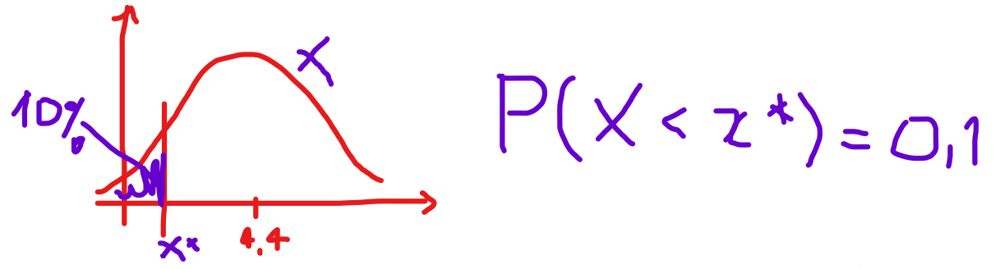
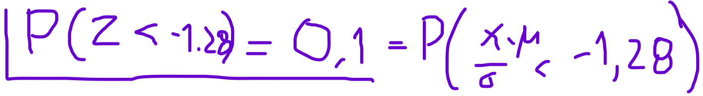

\addtolength{\headheight}{1.0cm}
\pagestyle{fancyplain} 
\lhead{\includegraphics[height=1.5cm]{logoIME.png}}
\rhead{\includegraphics[height=1.5cm]{logoEAD.png}}
\chead{UNIVERSIDADE FEDERAL DO RIO GRANDE DO SUL \\
INSTITUTO DE MATEMÁTICA E ESTATÍSTICA \\
DEPARTAMENTO DE ESTATÍSTICA \\
\vspace{0.3cm}
MAT02219 - Probabilidade e Estatística - 2021/2
}
\renewcommand{\headrulewidth}{0pt} 


```{r setup, include=FALSE}
knitr::opts_chunk$set(echo = TRUE)
```

# Avaliação Parcial de Área 2

Relembrar:

* Variáveis Aleatórias
    + definição, discretas e contínuas;
    + distribuição de probabilidade e função de distribuição, propriedades;
    + esperança e variância, propriedades;
    + modelos de distribuição de probabilidade;

* Distribuição amostral
    + estatísticas e suas distribuições;
    + teorema central do limite (TCL)

* Inferências Estatística
    + objetivos e introdução
    + estimação pontual, estimador e estimativa;
    + erro padrão
    + estimação intervalar;

* Intervalos de Confiaça:
    + para a uma média populacional $\mu$, com variância conhecida ou desconhecida;
    + para uma variância populacional $\sigma^2$;
    + para uma proporção populacional $\pi$.
    
\vspace{0.5cm}

Usar o **formulário** para resolução das questões.

\vspace{0.5cm}

**Boa avaliação!!!**

<!-- \vspace{0.5cm} -->

***
## Rever planos de aula, slides e vídeos.
## Fazer o simulado para a prova 2 - VALE PONTO EXTRA!!!
## Fazer a prova 2 até o dia 04/01.
***  


\clearpage

<!-- \vspace{2.0cm} -->

<!-- ## Exercícios resolvidos -->
<!-- Pasta com slides de soluções de exercícios: em https://github.com/markus-stein/MAT02219EAD/tree/master/exercicios-resolvidos -->

<!-- * Probabilidade e sorteio sequencial, sem reposição -->
<!--     + slides: https://github.com/markus-stein/MAT02219EAD/blob/master/exercicios-resolvidos/exercicio-resolvido_sorteio-sequencial-caixas.pdf -->
<!--     + video: https://youtu.be/G27cskmrTyw -->

<!-- * Probabilidade condicional de dois eventos + BONUS -->
<!--     + slides: https://github.com/markus-stein/MAT02219EAD/blob/master/exercicios-resolvidos/exercicio-resolvido_probabilidade-condicional-conceito-concurso+bonus.pdf -->
<!--     + video: https://www.youtube.com/watch?v=RUqGhH3zuTg -->

<!-- * Probabilidade Sorteio Condicional -->
<!--     + slides: https://github.com/markus-stein/MAT02219EAD/blob/master/exercicios-resolvidos/exercicio-resolvido_probabilidade-sorteio-condicional-urna-duas-moedas.pdf -->
<!--     + video: https://www.youtube.com/watch?v=Q84qK1hgM54 -->


<!-- No `R` é possível gerar amostras, calcular a mádia de cada a mostra e plotar o histograma:   -->
<!-- (*usamos `replicate` para gerar 100 amostras de tamanho n= 25, 50 e 100*) -->

<!-- * a.a. de $X \sim Poisson(2)$ -->
<!-- ```{R, fig.height=2, fig.width=6, fig.align='center'} -->
<!-- par(mfrow=c(1,3)) -->
<!-- hist( colMeans( replicate( n = 100, rpois( n = 5, lambda = 2))), main="Poisson(2), n=5") -->
<!-- hist( colMeans( replicate( n = 100, rpois( n = 10, lambda = 2))), main="Poisson(2), n=10") -->
<!-- hist( colMeans( replicate( n = 100, rpois( n = 50, lambda = 2))), main="Poisson(2), n=50") -->
<!-- ``` -->

<!-- * $X \sim Uniforme(0,1)$ -->
<!-- ```{R, fig.height=2, fig.width=6, fig.align='center'} -->
<!-- par(mfrow=c(1,3)) -->
<!-- hist( colMeans( replicate( n = 100, runif( n = 5, min = 0, max = 1))), main="Uniforme(0,1), n=5") -->
<!-- hist( colMeans( replicate( n = 100, runif( n = 10, min = 0, max = 1))), main="Uniforme(0,1), n=10") -->
<!-- hist( colMeans( replicate( n = 100, runif( n = 50, min = 0, max = 1))), main="Uniforme(0,1), n=50") -->
<!-- ``` -->


## Resumo do encontro de dúvidas

### Lista 2-2 
Exercício **11(g)**

* Dados do problema:   

    + $X$: taxa de albumina no sangue em pessoas sadias ou normais;   
    
    + $X \sim Normal(4,4; 0,6^2)$.   

* No item (e) pede "a taxa de albumina que é ultrapassada por 5% da população".     

    + Ver o fórum de dúvidas da área 2, nosso monitor Andrei resolveu o item (e).    
    
    https://moodle.ufrgs.br/mod/forum/discuss.php?d=421833#p2229541

* No item (g) pede "a taxa de albumina que não é ultrapassada por 10% da população".    

    + precisamos encontrar um valor $x^*$ da distribuição de $X$ tal que a área abaixo dele seja?!  



Assim segue o mesmo raciocínio do item (e)  




### Quiz 2-2
* Questão 1 e 2 precisam de valores da tabela `t` e qui-quadrado, porque em uma distribuição parece que procuramos valores unilaterais e em outra bilaterais, usamos $\alpha$ ou $\alpha/2$?      

    + No video https://www.youtube.com/watch?v=v6BgWhAmV5I&t=42s a Profa. Lisiane fala dessa diferença nas tabelas que usamos.      
    
    + Importante é ter em mente que queremos encontrar valores de distribuições de probabilidade que deixam uma certa área acima ou abaixo deles.     
    
* Questão 2 pede "intervalo de XX% de confiança para a variância populacional";      

    + O enunciado diz que a média populacional é desconhecida e fornece a média amostral e desvio padrão amostral;      
    
    + Nosso alvo aqui é o parâmetro **variância populacional**, então usaremos a estatística **variância amostral** para estimá-la;    
    
    + Nunca saberemos os valores dos **parâmetros** que são nosso alvo em inferência, assim usamos **estatísticas** e **intervalos de confiança** baseados nas estatísticas na estimação.